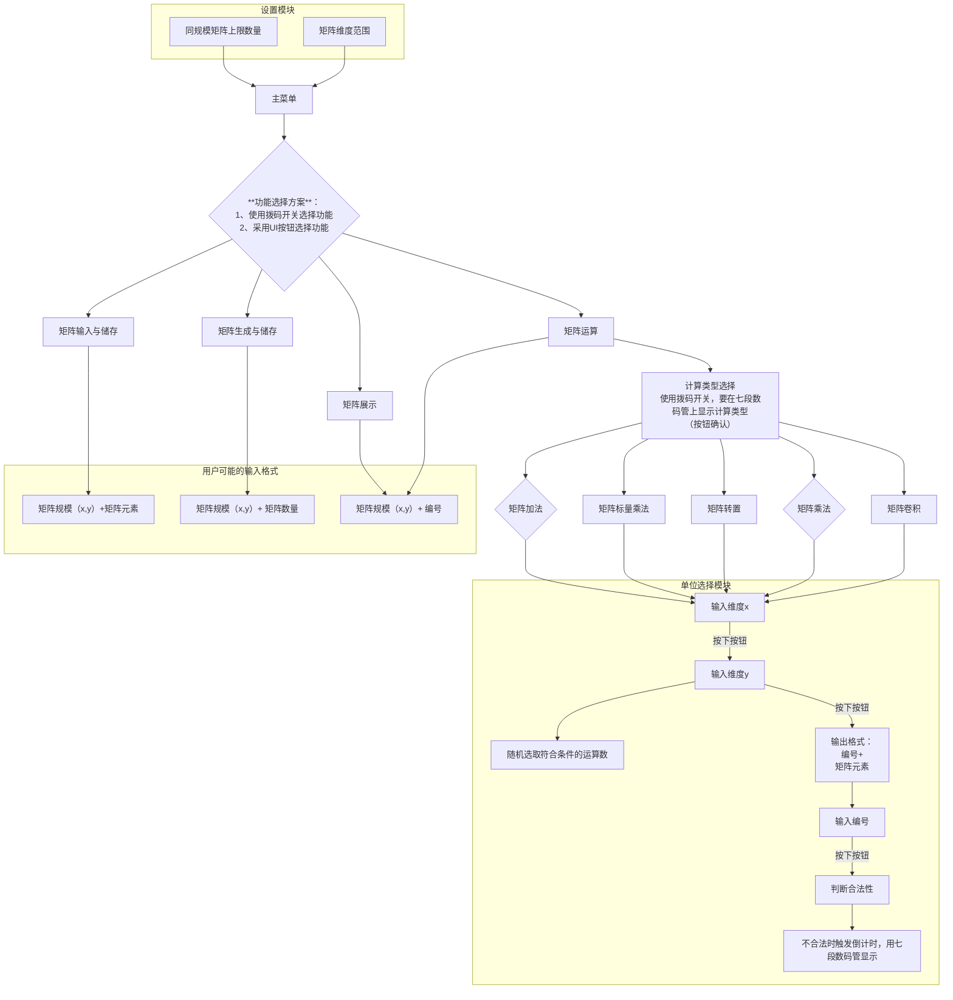

# CS207_Project

## 功能流程图

## 更新说明

把 top.v 作为主文件（只搭了框架），烧上去后打开 uart 通信。

五个拨码开关控制五种模式，拨动某一个再按中间按钮可以进入相应模式，会在数码管上和 uart 上都显示一遍，按 rst 才能回到 default 模式。

已经写好了 show 模式，轮流输入两个维度然后显示。目前并没有接入输入矩阵和生成矩阵的功能，所以现在显示的矩阵是我随便塞进去的，后面两个功能加了以后扔掉即可。

